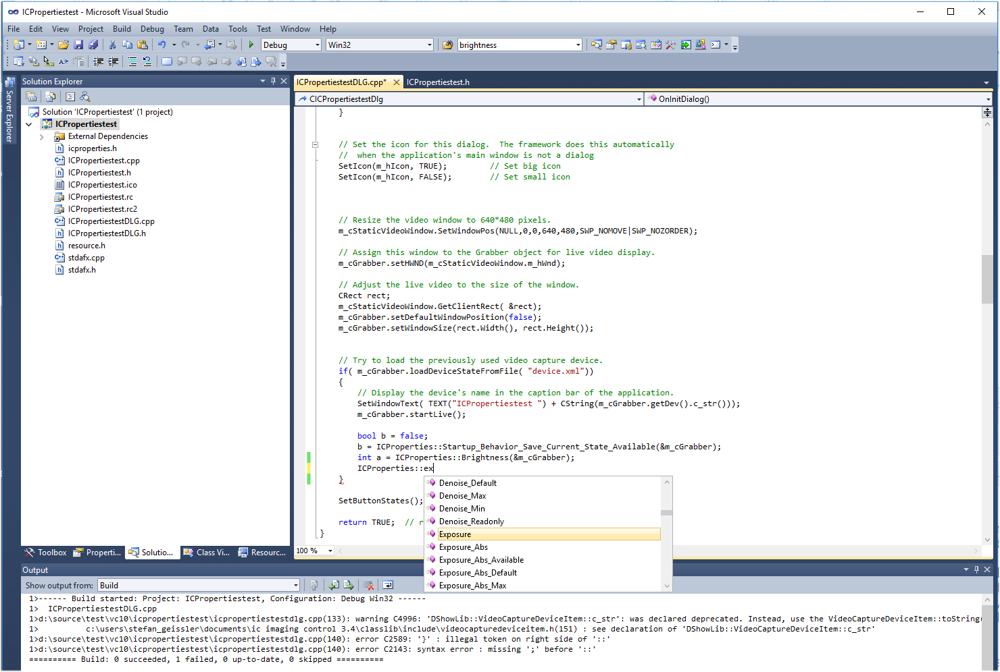

# Create Source Code for VCD Properties automatically
For many programmers the highly-flexible VCDProperties interfaces for IC Imaging Control is too complicated. Instead they would prefer a simple function call for setting an exposure time, e.g.
``` C#
ICProperties.Exposure_Abs(IcImagingControl1, 0.0303);
```

The little tool in this directory is made for that. It generates functions for get, set, isavailable, isreadonly, get default, get min and get max, as well as push for all properties automatically and creates a new class named "ICProperties". There generated code also offers useful error handling in the functions.
The generated file has to be added to the C# or VB.NET project or included in C++ source file and can be used immediately.
Since most cameras have the same property sets, the generated class can be used for many camera models.
Visual Studio Intellisense offer all functions of the generated ICProperties class. 



The tool's source code is written in C#. The "project.xml" controls which files to be created and which templates are used.
All properties are generated using templates, only the property name, the item ID and element ID are variable. The IC Imaging Control VCDProperties export five interfaces for properties:
- range, which is an integer value
- absolute, which is a double value
- switch, which is a bool value for e.g. automatics on an off
- push, which executes a function, e.g. white balance one push 
- mapstrings, which contains a list of strings

Therefore, there are five templates, one for each interface.

The zip file CreatePropertiesForCameras.zip contains the compiled, ready-to-use version of the program. 

If you want to compile on your own, IC Imaging Control .NET is required.
