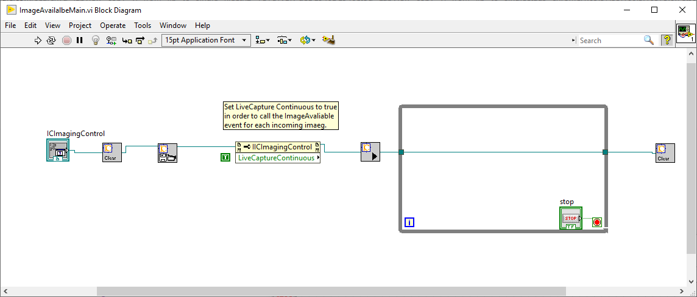
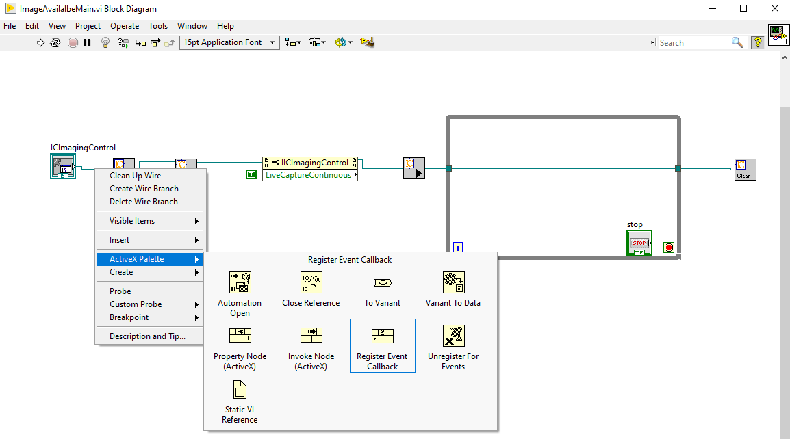
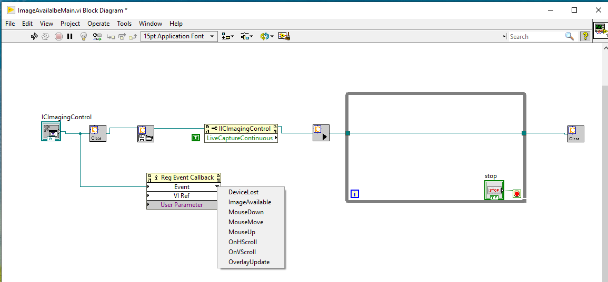
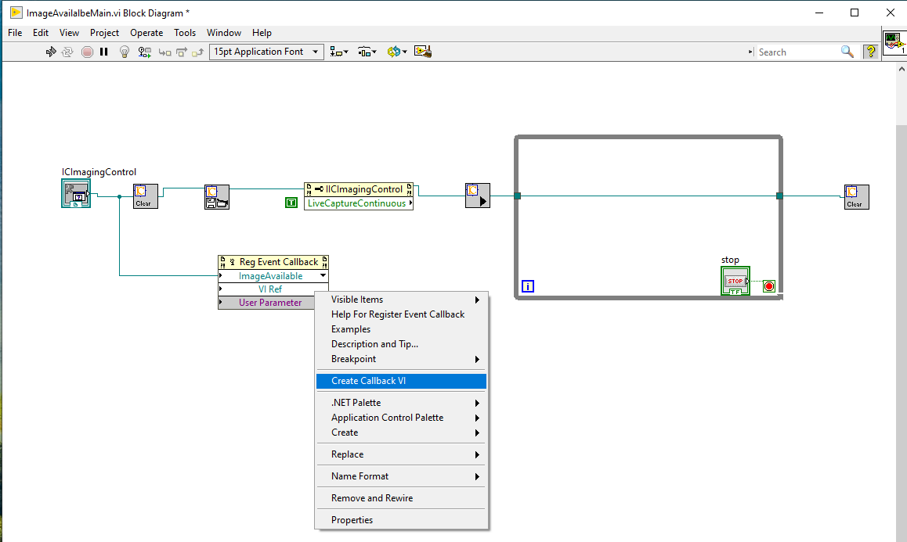
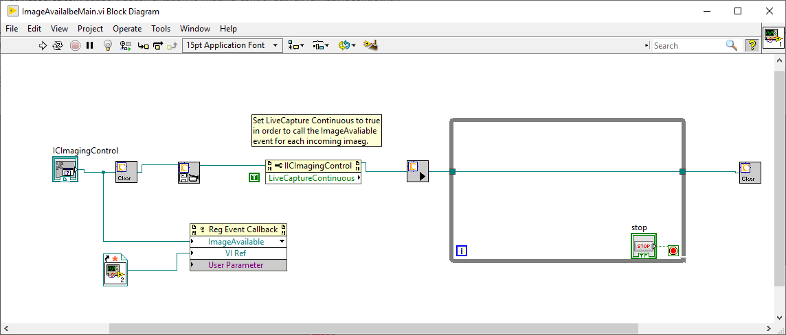
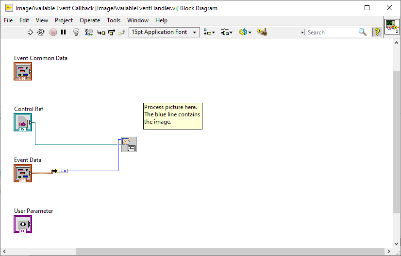

# ImageAvailable Event
## Introduction
This sample shows how to implement an ActiveX event handler in LabVIEW. In particular it shows, how to use the IC Imaging Control `ImageAvailable` event in LabVIEW.

Please download and install the [IC LabVIEW Extension](https://www.theimagingsource.com/support/downloads-for-windows/extensions/icextlvi/) first.

The `ImageAvailable` event is called every time a new frame is copied into memory. For more details about the event, please refer to [ImageAvailalbe](https://www.theimagingsource.com/support/documentation/ic-imaging-control-activex/event_descICImagingControl_ImageAvailable.htm) documentation. If the event shall be called automatically, the [LiveCaptureContinuous](https://www.theimagingsource.com/support/documentation/ic-imaging-control-activex/prop_descICImagingControl_LiveCaptureContinuous.htm) property of IC Imaging Control must be set to `true`.

Using the `ImageAvailable` event is recommended if a The Imaging Source camera runs in trigger mode. The main program does not need to wait for an image and therefore wont block, if there is no image

The `ImageAvailable` event is the fastest way of receiving images from the The Imaging Source camera. 

Make sure, your image processing is fast enough to match the camera's frame rate or external trigger frequency.

Saving images to hard disc in `ImageAvailable` event is not recommended, if the frequency of incoming images is too high.

The sample contains a new Sub VI `IC_Buffer_to_Picture.vi`, which converts an ImageBuffer into a Picture. An IMAQ version is not available currently.

## Building the VIs
### ImageAvailableMain.vi
Start with a simple camera showing live video vi:

Invoke the property `LiveCaptureContinuous` from the IC Imaging Control reference, change it to write and connect a boolean constant of value `true`.

### Regsiter Event Callback
This is the "secret" LabVIEW part about how to handle ActiveX events. 

Right click the green line from IC Imaging Control and select "ActiveX Palette". There select "Register Event Callback".

### Select the Event

Now select the `ImageAvailable` event by a right click on "Event" of the `Reg Event Callback`. As shown in the image, there are more events available. The DeviceLost event is fired if a device disconnects. This allows to add usefull error handling in the case of device disconnection to a VI.
A documentation of available events is at [IC Imaging Control ActiveX Documenation](https://www.theimagingsource.com/support/documentation/ic-imaging-control-activex/ICImagingControl.htm) on the bottom of the page.   

### Create Event Handler VI
After the `ImageAvailable` event was selected, the event handler VI must be created.

Right click on "VI Ref" and select "Create Callback VI". The event handler VI is created:

### ImageAvailable Event Handler
The `ImageAvailable` event handler receives as parameter the buffer index of the new image in the [ImageBuffers](https://www.theimagingsource.com/support/documentation/ic-imaging-control-activex/ImageBuffers.htm) collection of IC Imaging Control. The buffer index and the IC Imaging Control reference is passed to the `IC_Buffer_to_Picture.vi`, which returns a LabVIEW Picture containing the image made by the camera. 

