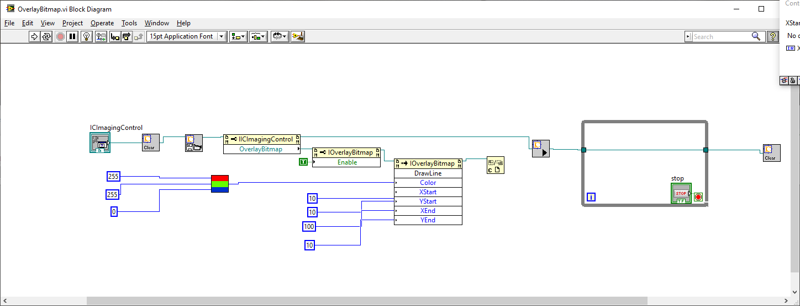
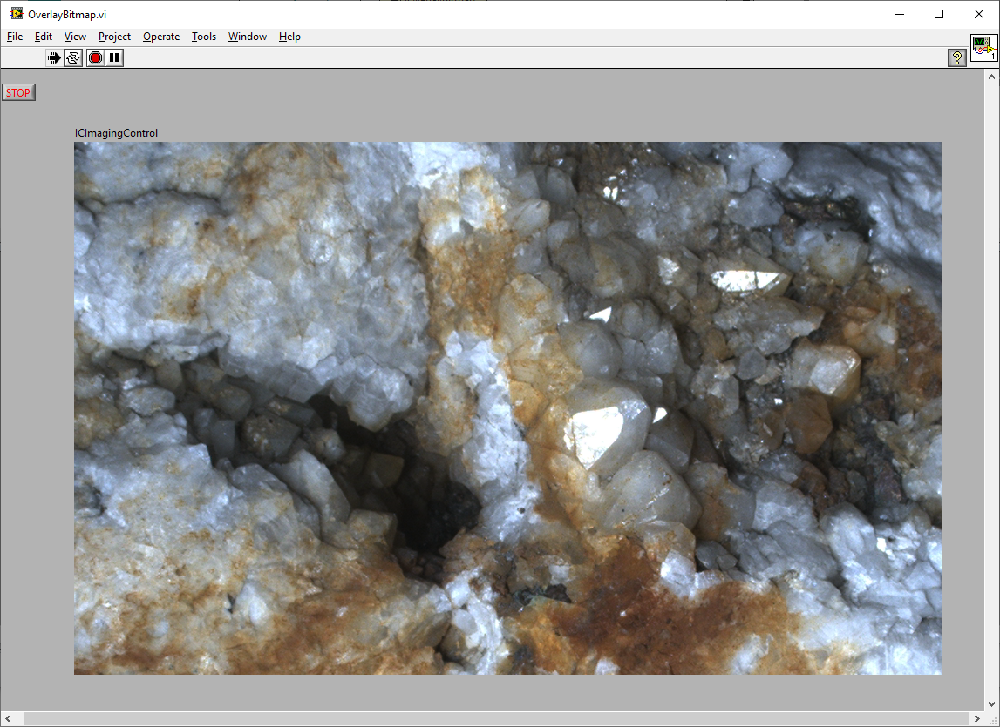

# Overlay Bitmap
## OverlayBitmap.vi
This very simple VI shows how to draw a yellow line on the live video.

The `OverlayBitmap` object is a property of `IC Imaging Control` and invoked by a property node. The `OvererlayBitmap` must be enabled by passing `True` to its property [Enable](https://www.theimagingsource.com/support/documentation/ic-imaging-control-activex/prop_descOverlayBitmap_Enable.htm). In the sample the [drawLine](https://www.theimagingsource.com/support/documentation/ic-imaging-control-activex/meth_descOverlayBitmap_DrawLine.htm) method is used. The `RGBtoColor.vi` converts the values for red, blue and green to the color value used by the `OverlayBitmap` drawing methods.

The complete documentation of the OverlayBitmap can be found at 
[OverlayBitmap](https://www.theimagingsource.com/support/documentation/ic-imaging-control-activex/OverlayBitmap.htm).

