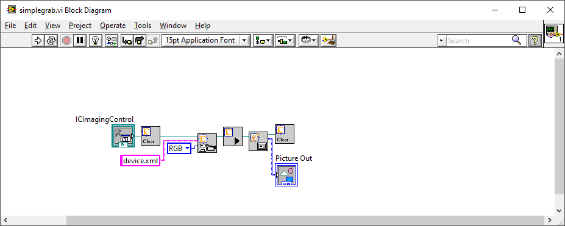
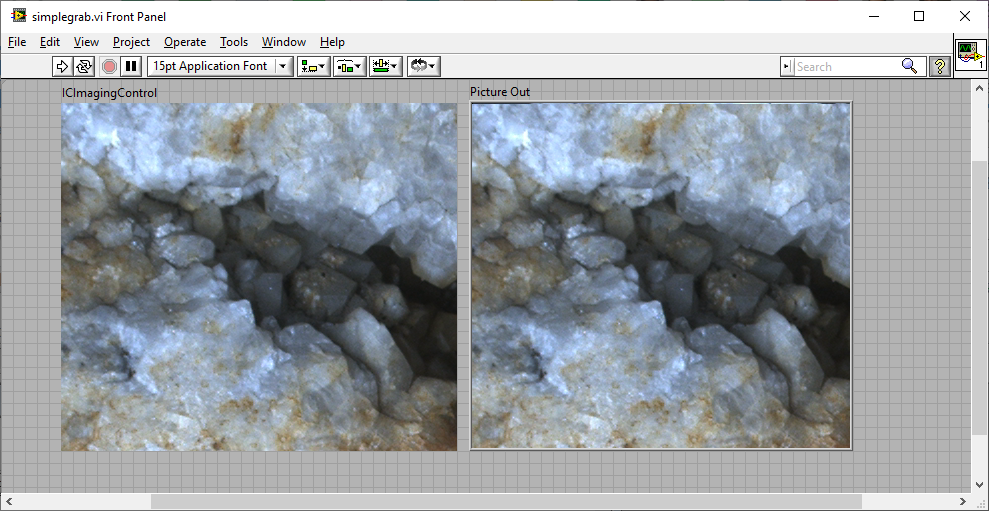

# Simple Grabbing
## Simplegrab.vi
This very simple VI shows how to to grab an image from the camera and show it in a LabVIEW PictureBox

## Reqirements:
* National Instruments LabVIEW 2010 or higher
* IC Imaging Control LabVIEW Extension
* The Imaging Source camera.
  
## Comment  
Instead of the "IC_OpenDevice.vi", this sample uses the "RestoreDevice.vi". (I have the suspect, the IC_OpenDevice.vi uses ICY8 instead of ICY800, if a monochrome image shall be saved.)
