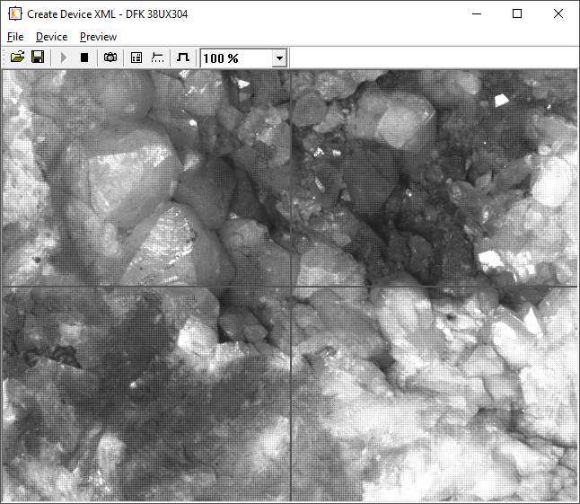
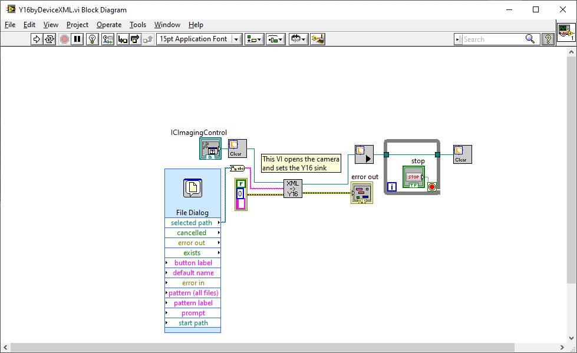
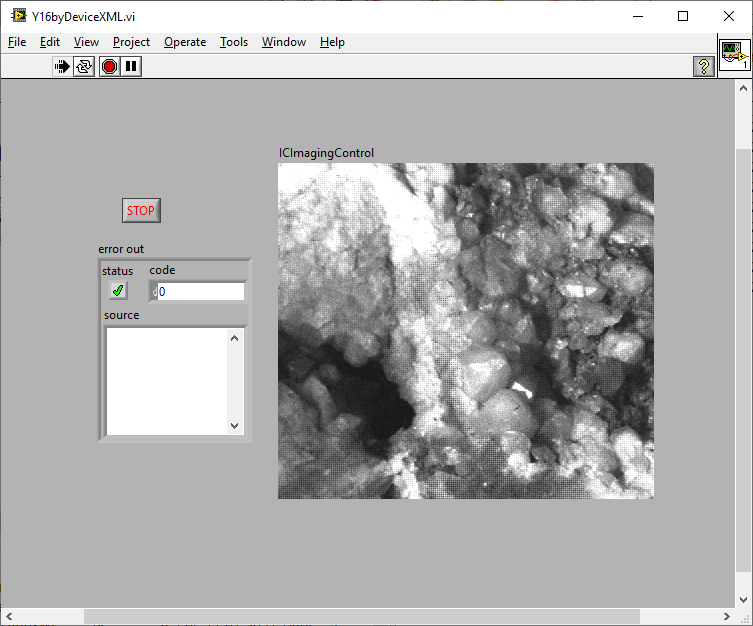

# Using Y16 16bit Gray Scale
## Y16byDeviceXML.vi
This  VI shows how to use the `OpenY16DeviceByXML.vi` for opening a device with Y16 video format using a previously created device state xml file. The xml file is created by the program `CreateDeviceXML.exe` in the subdirectory `Create Device XML`.

The `Y16byDeviceXML.vi` handles Y16 video format only. All other video formats will lead to a `start live failed` error, because there is no conversion into Y16 pixel formats in IC Imaging Control.

## Reqirements:
* National Instruments LabVIEW 2010 or higher
* IC Imaging Control LabVIEW Extension
* The Imaging Source camera.
  
## Create a device state xml

Start the program `CreateDeviceXML.exe` and configure the camera accordingly. Click the "File" and select "Save Configuration" in order to save the device state.
Of course this program can be used for creating device state xml files with color formats for use with other programs which load such an configuration file. Not only LabVIEW, but also other IC Imaging Control using programs.

## Load in LabVIEW

A file open dialog is used for selecting the above saved file. Please note, the `OpenY16DeviceByXML.vi` is a newer version, than the one provided with the IC LabVIEW Extension. 

