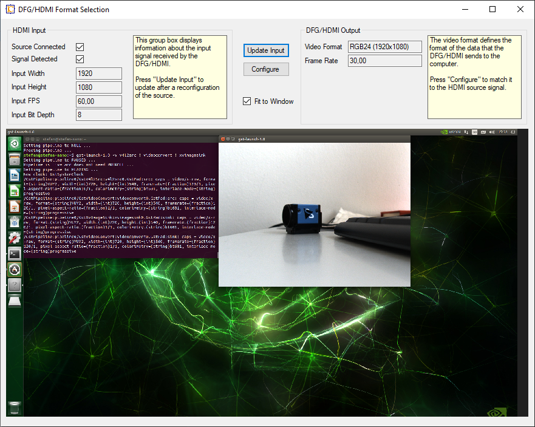

# DFG/HDMI Programming Sample

This C# programming example shows how to set the video format of the [DFG/HDMI](https://www.theimagingsource.com/products/converters-grabbers/hdmi-to-usb-converters/dfghdmi/) video converter automatically to the input format of the HDMI source.

The image shows the HDMI output of a TX Nano converted on a Windows computer.

Required:
 * The Imaging Source [DFG/HDMI](https://www.theimagingsource.com/products/converters-grabbers/hdmi-to-usb-converters/dfghdmi/)
 * [Driver](https://www.theimagingsource.com/support/downloads-for-windows/device-drivers/icwdmuvccamtis33u/) for DFG/HDMI
 * [IC Imaging Control 3.5 .NET](https://www.theimagingsource.com/support/downloads-for-windows/software-development-kits-sdks/icimagingcontrolcsharp/)
