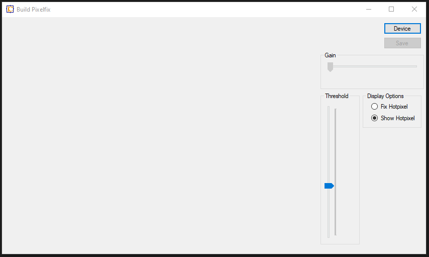
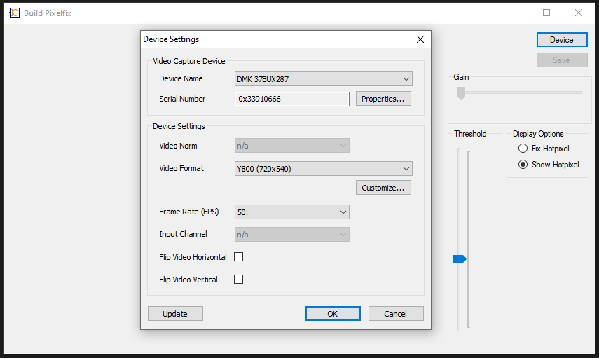
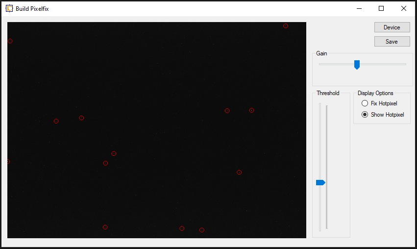
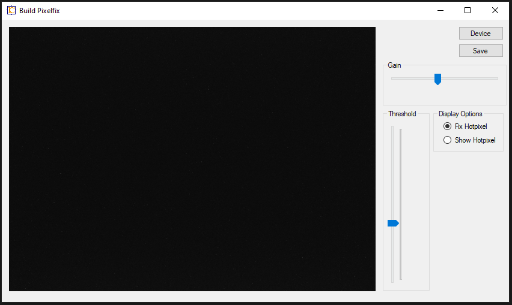
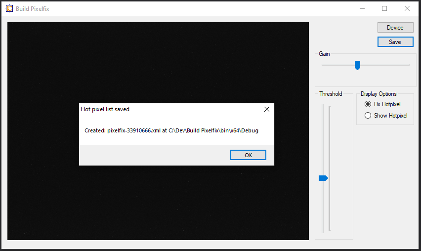

# Getting Started with Build Pixelfix

## Dependencies:
 - VC Runtime
 - .NET 4.0 Framework
 - IC Imaging Control 3.5
 - The Imaging Source video capture device / camera.

## Preparing
Before starting, make sure, the image provided by the camera is very dark, best black, no light. The most suitable way is mounting the protection cap on the camera apperture, which is delivered with every camera with housing. 

## Usage
After starting "Build Pixelfix" the program shows up as follows:

A click on "Device" button shows the device selection dialog:

For a good pixel fix the settings of gain and threshold have to be adjusted in order to find nearly every real hot pixel. For this we adjust Gain and the Threshold.

If too much gain is used, the the noise will create too much wrong hot pixels. Therefore, gain should be used with care.

The threshold specifies the brightness, which qualifies a pixel to be a hot pixel. The default threshold is 100, which means, that a hot pixel must have a brightness of at least 100 in a range from 0 to 255.

The "Display Options" allow to switch between display of found hot pixel being marked by red circles, if "Show Hotpixel" is marked. If "Fix Hotpixel" is marked, then the "hot pixel fixed" black image is shown, so the result can be checked.

The list of found hot pixels is saved by a click on the "Save" button. The pixel fix frame will needs this file.

The file is named "pixelfix-nnnnnnnn.xml", where "nnnnnnnn" is replaced by the serial number of the camera, for which the hot pixel list was created.
This file has to be copied into the working directory of the program, that uses the pixelfix frame filter.

## Programming
This sample shows, how to use the FrameQueueSink of IC Imaging Control 3.5, how to create a System.Drawing.Bitmap from the passed IFrame and how to display that Bitmap in a PictureBox.
