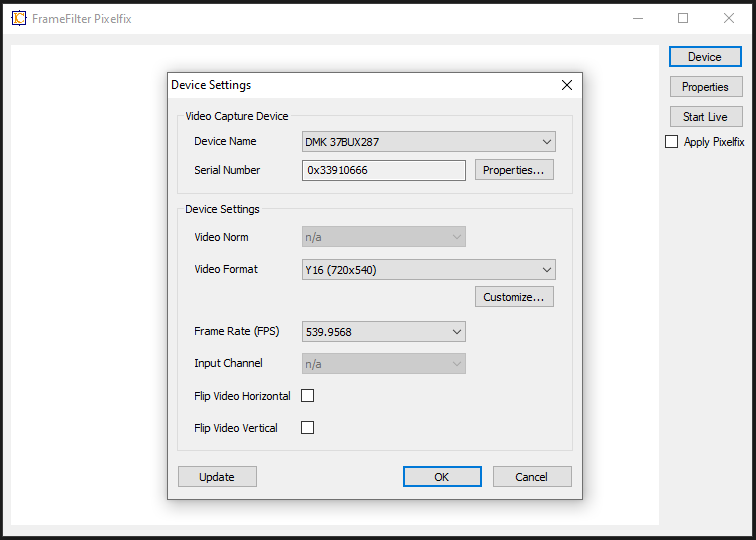
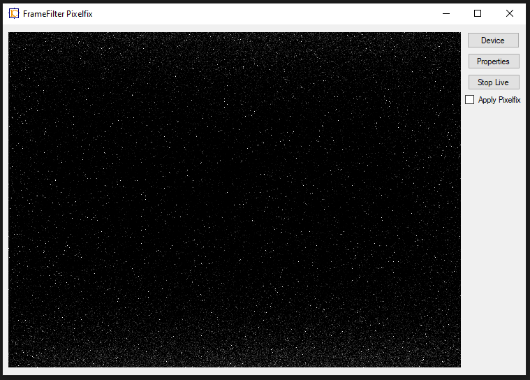
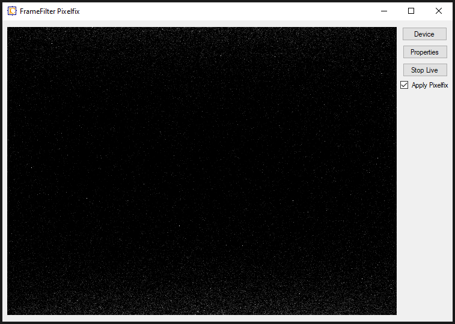

# Getting Started with FrameFilter Pixelfix

## Dependencies:
 - VC Runtime
 - .NET 4.0 Framework
 - IC Imaging Control 3.5
 - The Imaging Source video capture device / camera.

## Demo program
The demo program shows how to use the pixel fix.

### Program start
After starting "FrameFilter Pixelfix" the program shows up as follows:

- 


A click on "Device" button shows the device selction dialog:
- 

After a video capture device was selected, the "Start Live" button is clicked. The video looks as shown in the next image:

- 

High gain and long exposure time will amplify the hot pixels.

### Apply Pixelfix
If the checkbox "Apply Pixelfix" is checked, the pixel fix frame filter becomes active and the visible number of hot pixel should be reduced significantly:
 
- 

## How to use in an own C# program

The PixelFixfitler.cs file must be added to the project.
In the class, that uses the video capture device with IC Imaging Control a new member must be added:

``` C# 
private TIS.Imaging.PixelFixFilter MyPixelFixFilter
```
Next the filter must be created and added to the IC Imaging Control project:
``` C# 
MyPixelFixFilter = new PixelFixFilter(icImagingControl1);

icImagingControl1.DeviceFrameFilters.Add(icImagingControl1.FrameFilterCreate(MyPixelFixFilter));
MyPixelFixFilter.setEnable(true); // Enable the pixel fix.
```
The pixel fix filter will load the previously created list of hot pixels automatically and applies it to the incoming images. The "Build Pixelfix" program creates a file with that list. The file is named "pixelfix-nnnnnnnn.xml", where "nnnnnnnn" is replaced by the serial number of the camera, for which the hot pixel list was created.
This file has to be copied into the working directory of the program, that uses the pixelfix frame filter.

