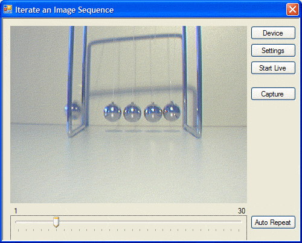

# Iterating Through A Captured Image Sequence

This C# programming example shows how the last two seconds leading up to an unknown event can be captured to an image sequence.

## Introduction
The last two seconds leading up to an unknown event should be captured to an image sequence. In this example, the event is fired by clicking on a button. After this event has occurred, the user can iterate manually or automatically through the captured images.

This sort of application could be used in various kinds of sports to review movements of athletes. For example, the movements of an athlete doing long jumps are to be checked. The coach clicks on the Capture button when the athlete lands in the sandbox. The seconds before the landing - especially the jump - can be called back, allowing the coach to discuss the jump with the athlete. The same could be done, for example, with golfers and tennis players etc.

The following techniques illustrated in this example:

- How to quickly retrieve data from ImageBuffers.
- How to find the oldest image in the ring buffer, using the ImageBuffer.SampleStartTime.
- How to use a Delegate to enable a button from the ImageAvailable event.
  
The application looks as follows:



After the application has been started, a video capture device can be selected by clicking on the Device button. The live video can be started by clicking on the Start Live button. After two seconds, the first images of the live video have filled the ring buffer. Next, the Capture button is enabled by the application and the end user can trigger the capture event, by clicking on the Capture button when it is needed. If the Capture button is clicked, the live video stream stops and the oldest captured image is displayed in the IC Imaging Control window. The oldest image in the ring buffer is the first image to be displayed. The slider below the IC Imaging Control window is used to move through the captured images (forward and backward). The end user may click on the Auto Repeat button, in order to quickly display the images in a loop.

## Variables needed by the main class of the application.
After the ```Capture```  button has been clicked, the variable StartIndex stores the index of the oldest image in the ring buffer. The oldest image is displayed first or when the slider below the IC Imaging Control window is positioned at 0.

The variable Image stores a reference to the ring buffer that contains the image sequence. This enables direct and very fast access to the ring buffer.

The variable FrameCount is used to count the captured frames after the live video has started. Once the image ring buffer has been initially filled (indicated by FrameCount), the Capture button is enabled. This indicates that the application is now ready to capture and display a full sequence.

TimerCurrentImage is used as a frame index for the automatic display loop. The timer event automatically displays the frames. In this event, the TimerCurrentImage is incremented and used to index the image in the ring buffer that should be displayed.

The variable Seconds determines the length of the image sequence to be captured. In this example, it is set to 2. It can be set to other values as the application demands. The maximum value of Seconds depends upon the amount of available memory and the frame rate of the video capture device.


``` C#
// The variable "StartImage" is used to save the index of the oldest image in the image ring buffer.
int StartImage;

// The variable "TimerCurrentImage" is used for the index of the currently displayed image,
// due auto repeat of the image sequence is running.
int TimerCurrentImage;

// "Images" will contain a copy of the image ring buffer, in order to get faster acces to the images.
TIS.Imaging.ImageBuffer[] Images;

// The variable "FrameCount" is used to count the capture frames. If "FrameCount"
// is greater than the image ring buffer size, the "btnCapture" will be enabled and
// the user knows the image sequence in the ring buffer is now filled up completely.
// FrameCount will be set to 0 in btnLiveVideo_Click after the live video has been started.
// It is incremented in the ImageAvailable event handler.
int FrameCount = 0;

// "Seconds" determins the length of the image ring buffer in seconds. If the image sequence should
// contain more or less seconds, only the value of "Seconds" need to be changed here.
int Seconds = 10;
```

#Calculation of the image ring buffer size

The size of the ring buffer is determined by the frame rate of the video capture device (for example, 30 fps) and the length of the image sequence to be captured (for example, 2 seconds). Now, the frame rate must be multiplied by the length in seconds. The result will be assigned to ```icImagingControl1.ImageRingBufferSize```. This can be done only after a video capture device has already been selected. In this sample, this is done in the ```btnDevice_Click``` button handler. The following source code illustrates how to select a device and how to calculate the ring buffer size:

``` C#
cImagingControl1.ShowDeviceSettingsDialog();

if (icImagingControl1.DeviceValid)
{
    // The last seconds before the capture button has been
    // clicked should be saved in the image ring buffer. Thus
    // the currently set frame rate multiplied by the value of "Seconds".
    icImagingControl1.ImageRingBufferSize = Convert.ToInt32(icImagingControl1.DeviceFrameRate
                                                            * Seconds);
```


In case, there is more than one camera specified in the ICCF file, a camera name plus serial number can passed:

``` C#
icImagingControl1.LiveStop();
try
{
    icImagingControl1.LoadDeviceState(ICCFImport.ICCFImport.Import("cameras.iccf", "DFK 33UX264 23040123"), true);
}
catch (ICException IEx)
{
    MessageBox.Show("Import of ICCF file failed:\n" + IEx.Message, "Import IC Capture File", MessageBoxButtons.OK, MessageBoxIcon.Warning);
}
```
# Handling the "Capture" event
The live video is stopped when the end-user clicks on the ```Capture``` button If it is necessary to continue capturing some time after the event (button click) has occurred, a call to ```Sleep``` can be inserted before the call to icImagingControl1.LiveStop. Each frame is automatically stored in the ring buffer, therefore the last two seconds of the captured images are now available for processing. In order to provide fast access to the images in the ring buffer, the reference of the ring buffer is copied to the application's variable ```Images```:

``` C#
// If the image sequence should contain images captures after the "Capture"
// button has been clicked, a call to "Sleep()" should be inserted before
// "LiveStop()" is called, e.g.:
//  System.Threading.Thread.Sleep(1000);
// This would the application continue capture one second after the "Capture"
// button has been clicked.

// Now stop the live video stream.
icImagingControl1.LiveStop();
btnLiveVideo.Text = "Start Live";
// Copy the reference of the ImageBuffers to get a faster access to the images.
Images = icImagingControl1.ImageBuffers;
```

A ring buffer is an array of image buffers, which are accessed in the following way: IC Imaging Control writes the first frame, coming from a video capture device, to the first element of the ring buffer. The second frame is written to the second buffer and so on. As soon as a frame has been written to the last element of the ring buffer, IC Imaging Control writes the next frame to the first buffer, overwriting the image data of the first frame. Thus, it is necessary to establish which image is the oldest in the ring buffer. This can be achieved using ```SampleStartTime``` - a property that is available for each image in the ring buffer. This is the time at which the image arrived on the host computer. Now, the application must run through the ring buffer and find the image buffer with the smallest SampleStartTime. The index of this image buffer is stored in the application's variable ```StartIndex```. It indicates the first image buffer to be displayed in the captured sequence. The oldest image can be calculated with the following loop:

``` C#
// Find the oldest image in the ring buffer. Its index is saved in
// the variable "StartImage".
double MinStartTime;

StartImage = 0;
MinStartTime = icImagingControl1.ImageBuffers[StartImage].SampleStartTime;

for (int i = 1; i < (icImagingControl1.ImageRingBufferSize - 1); i++)
{
    if (Images[i].SampleStartTime < MinStartTime)
    {
        StartImage = i;
        MinStartTime = Images[StartImage].SampleStartTime;
        break;
    }
}
``` 

In order to display the correct image when iterating through the ring buffer, the index (based on ```StartIndex```) needs to be calculated. For example the first, oldest image to be displayed is at position 25 in a ring buffer of 30 elements. If the application should display the first image with index 0, image 25 must be displayed from the ring buffer. The next image "1" is at position 26 in the image buffer. Thus, the content of ```StartIndex```, which is 25, is added to the index of the image that is to be displayed.

If the index is greater than 5, the position of the image in the ring buffer would be beyond the limits of the ring buffer (it would be 30). (The index in the ring buffer is zero based, which means for 30 elements it starts at 0 and ends at 29.) Thus, the application must be able to handle overflow. In this case, the image ring buffer size must be subtracted from the calculated position in the ring buffer. For example, the index of the image to be displayed in the image sequence equals 11, ```StartIndex``` equals 25 and the ring buffer size equals 30. Now, the position is calculated as 11 + 25 = 36. 36 is greater than 30, thus 30 must be subtracted from 36. The result is image sequence index 11 that maps to position 6 in the ring buffer.

The index calculation and image buffer display is illustrated in following source code:

``` C#
private void DisplayTheImage(int Index)
{
    int i;
    if (!icImagingControl1.LiveVideoRunning)
    {
        i = StartImage + Index;
        // Handling a possible overflow, in case the i is greater then the ring buffer size.
        if (i >= icImagingControl1.ImageRingBufferSize)
        {
            i = i - icImagingControl1.ImageRingBufferSize;
        }
        icImagingControl1.DisplayImageBuffer(Images[i]);
    }
}
``` 
# Enable the "Capture" button
The last step illustrates how to enable the ```Capture``` button after a sufficient number of frames have been captured. The variable ```FrameCount``` is set to 0 when the live video stream has started. In the ```ImageAvailable``` event of IC Imaging Control, ```FrameCount``` is incremented until it is greater than the ring buffer's element count (size). If this point is reached, the ring buffer has been completely filled with new images and the event can be fired. The ```Capture``` button can then be activated.

Since it is not recommended to change button state from within the ```ImageAvailable``` event directly, a ```Delegate``` should be used. The reason for this programming overhead is the use of different threads. The ```ImageAvailable``` event handler is called from IC Imaging Control's grabbing thread. The change of button states etc. are performed in the application's thread. Crossthread calls to controls can lead to application locks.

First off all, the function that enables the Capture button is created:
``` C#
private void EnableCaptureButton()
{
    btnCapture.Enabled = true;
}
```
Then, the ```Delegate``` is declared:
``` C#
public delegate void EnableCaptureDelegate();
```
In the ```ImageAvailable``` event, the variable ```FrameCoun```t is incremented until it is greater than the ring buffer's size. Once it is greater, the ```Delegate``` is called by ```BeginInvoke```. It receives as parameter the application's function to be called: ```EnableCaptureButton```.

``` C#
private void icImagingControl1_ImageAvailable(object sender, TIS.Imaging.ICImagingControl.ImageAvailableEventArgs e)
{
    if (btnCapture.Enabled == false)
    {
        if (FrameCount > icImagingControl1.ImageRingBufferSize)
        {
            // Now it is time to enable the capture button.
            BeginInvoke(new EnableCaptureDelegate(EnableCaptureButton));
        }
        else
        {
            FrameCount++;
        }
    }
}
```
